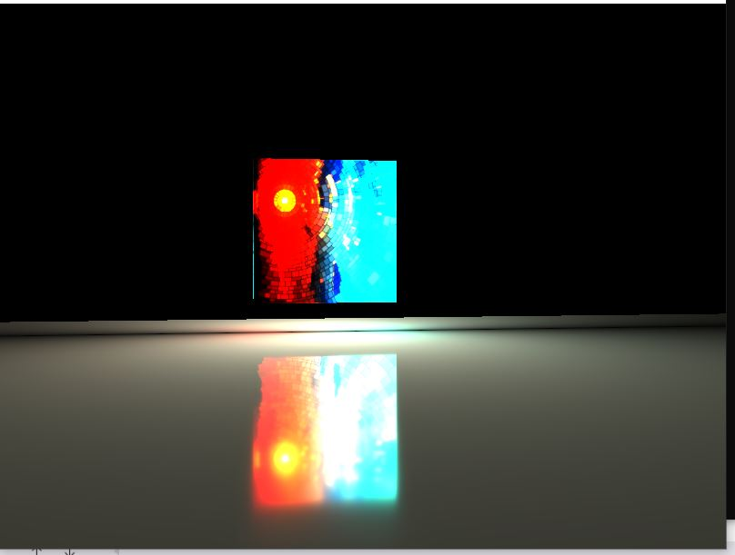
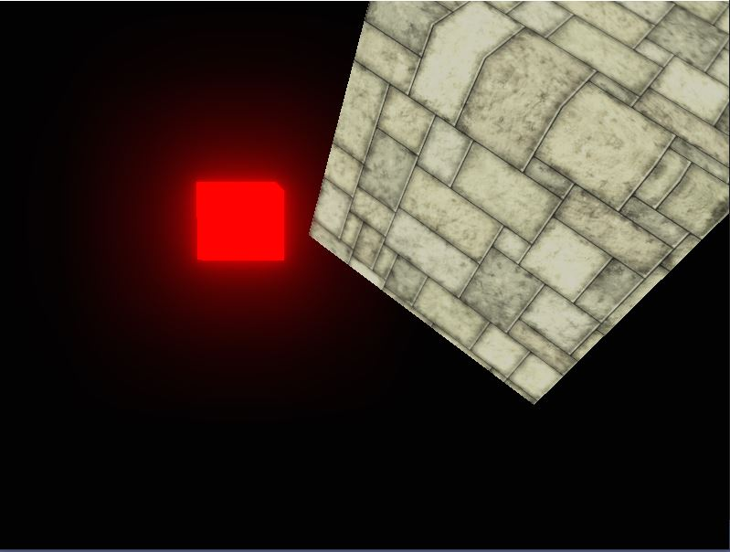
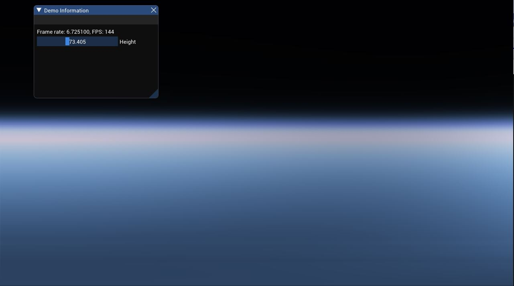
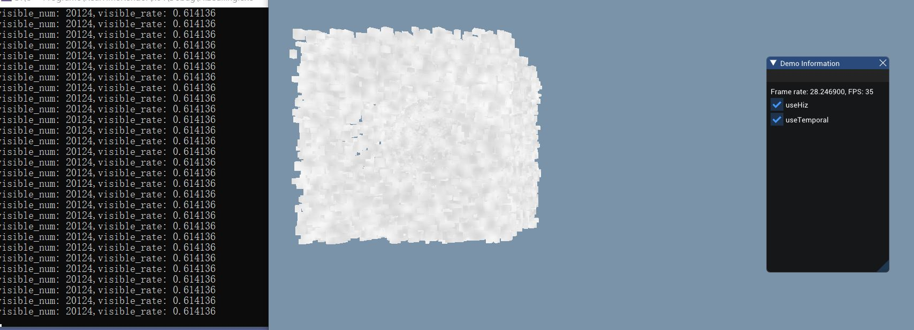
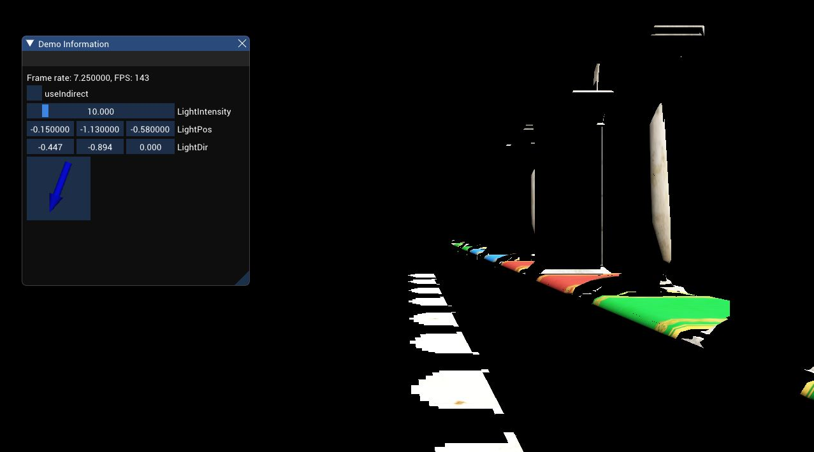
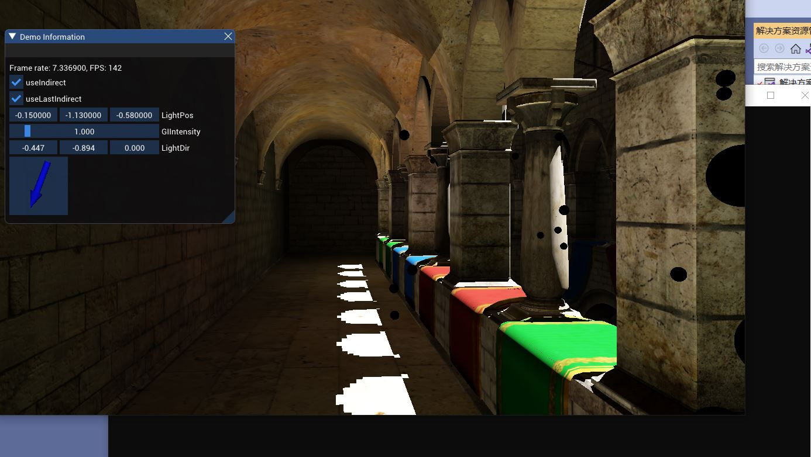
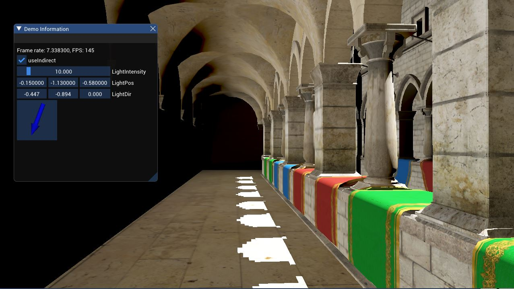
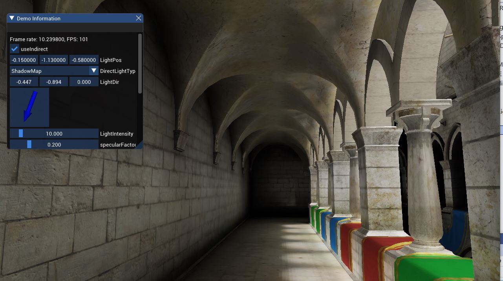
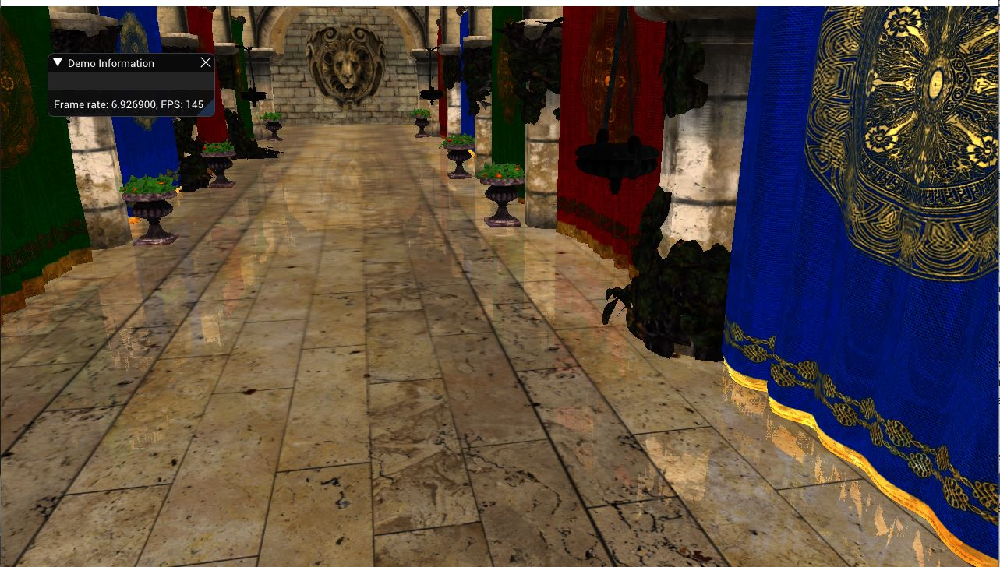

## 一些简单的图形学渲染算法实现
**目前已实现以下算法**
- LTC面光源
- 泛光效果
- 大气散射
- VXGI
- LPV
- PRT
- HiZ剔除
**项目配置**    
(使用的FRAME框架为https://github.com/AngelMonica126/GraphicAlgorithm)   
下载GraphicSDK https://pan.baidu.com/s/1XjYGrGhCO_KSqL7pCUzBrA 密码: 1234 ，然后将其解压即可   
用管理员的权限运行GraphicSDK里面的 Graphic.bat 以自动配置环境变量   
然后启动VS项目直接启动即可。   

**效果图**    
***LTC面光源***    
    
***泛光效果***    
  
***大气散射***    
  
***HiZ剔除***    
  
***DirectLight*** 
  
***PRTGI***    
  
***LPVGI***    
 
***VXGI***    
    
***SSR***    
 

